# Data-Aware DCR Graphs — Architecture & Design

This document explains the architecture, concepts, and data flow of the
data-aware DCR graph extension implemented in PM4Py-DCR.  The implementation
follows the formalisation presented in:

> Hildebrandt, T.T., Normann, H., Marquard, M., Debois, S., Slaats, T. (2022).
> *Decision Modelling in Timed Dynamic Condition Response Graphs with Data.*
> BPM 2021 Workshops, LNBIP 436, pp. 362–374.

---

## 1. Class Hierarchy

The data-aware layer builds on top of the existing PM4Py DCR class hierarchy.
Each layer adds a specific set of features.

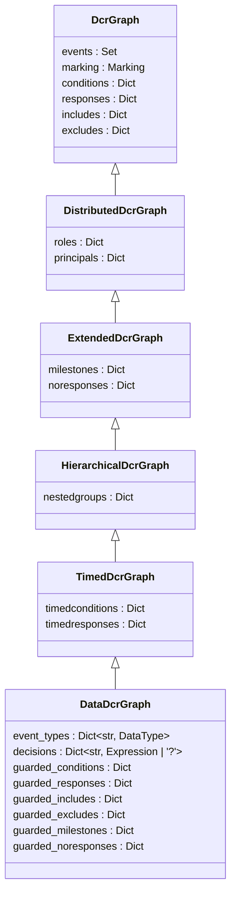

### Marking Hierarchy

The marking (runtime state of the graph) mirrors the class hierarchy:

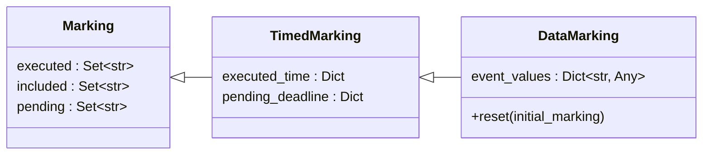

`DataMarking.event_values` stores the most recently produced value for each
executed event (e.g. `{'Amount': 800, 'Decision': 2}`).

---

## 2. Expression System (Definition 1)

Values in data-aware DCR graphs are integers or booleans.  Expressions form
an Abstract Syntax Tree (AST) that can be evaluated given the current event
values in the marking.

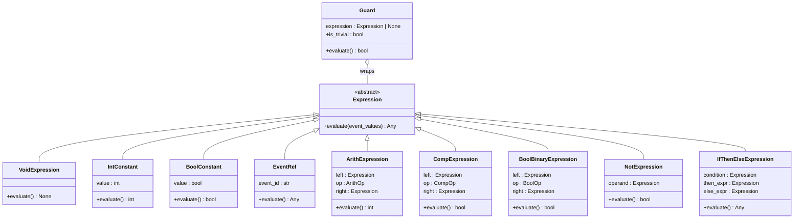

### Operator Enums

| Enum | Values | Domain |
|------|--------|--------|
| `ArithOp` | `ADD (+)`, `SUB (-)`, `MUL (*)` | int × int → int |
| `CompOp` | `EQ (==)`, `LT (<)`, `GT (>)`, `LE (<=)`, `GE (>=)` | int × int → bool |
| `BoolOp` | `AND (∧)`, `OR (∨)` | bool × bool → bool |

### Example: Decision Expression from the Paper

The expense report decision function uses a nested if-then-else:

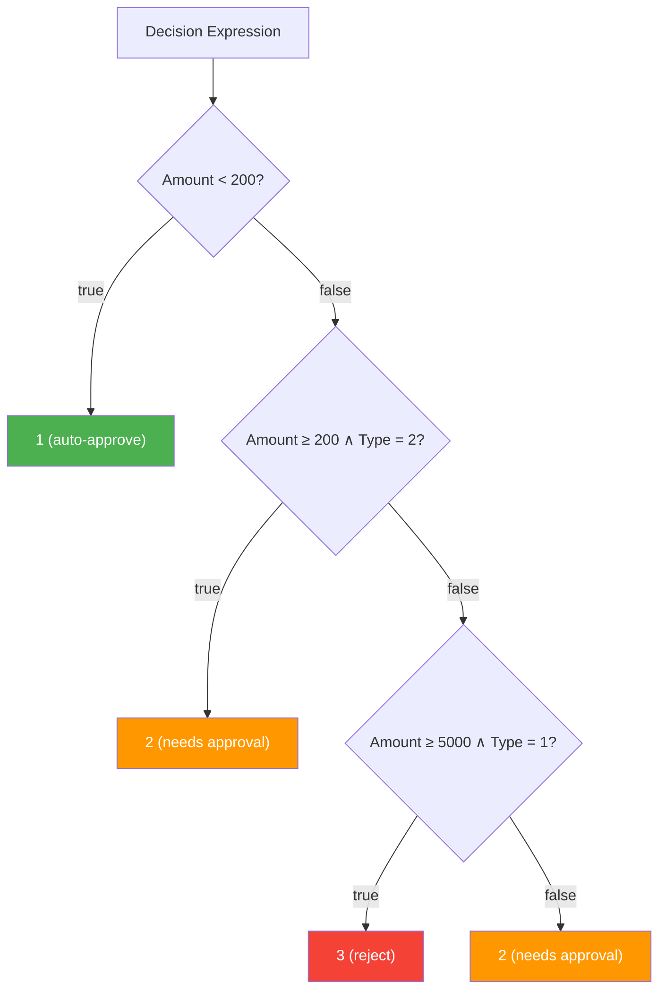

---

## 3. Event Classification (Definition 2)

Every event in a data-aware DCR graph has a **type** and a **decision function**:

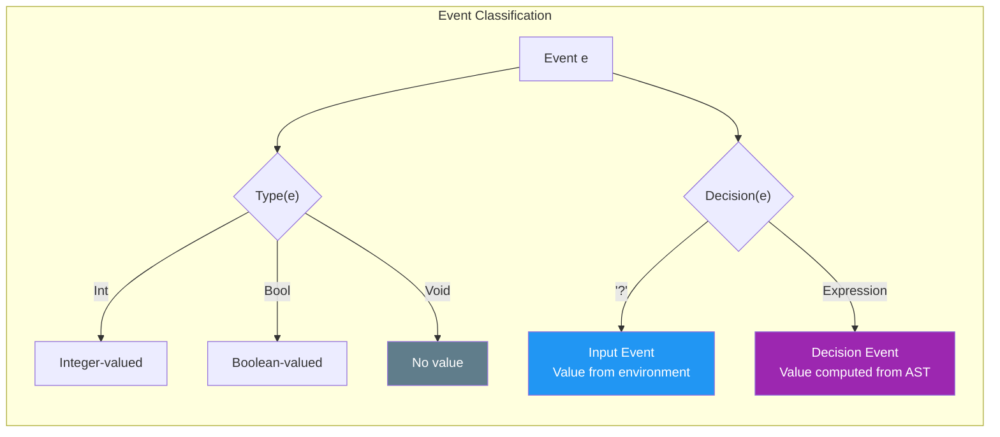

- **Input events** (`D(e) = ?`): receive their value from the event log or
  user at execution time.
- **Decision events** (`D(e) = expr`): compute their value by evaluating
  the expression over current event values in the marking.

---

## 4. Guarded Relations

Standard DCR relations (condition, response, include, exclude, milestone,
no-response) are always active.  **Guarded relations** carry a boolean guard
expression and only take effect when the guard evaluates to `true`.

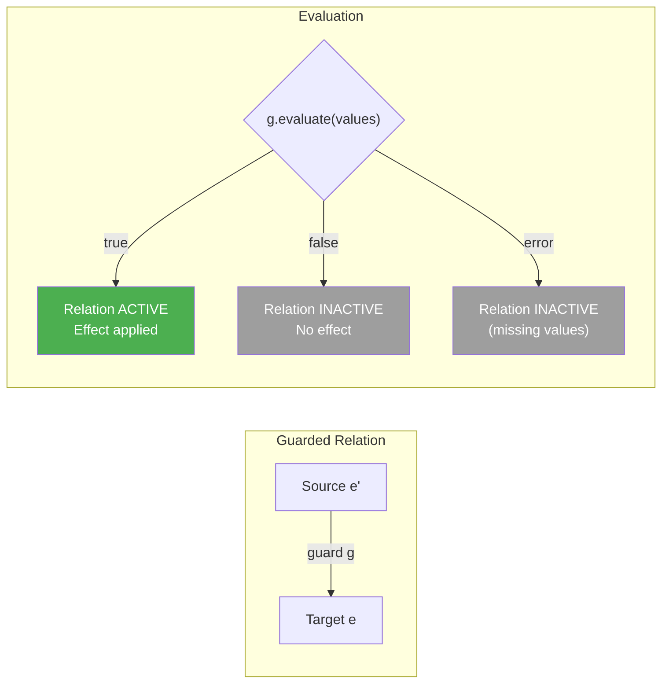

### All Six Guarded Relation Types

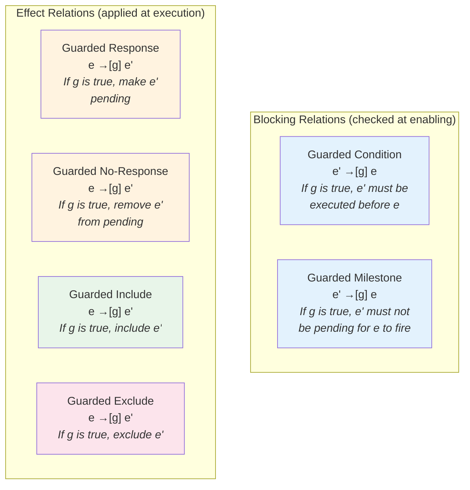

---

## 5. Enabling Semantics (Definition 3)

The enabling check determines which events can fire in the current marking:

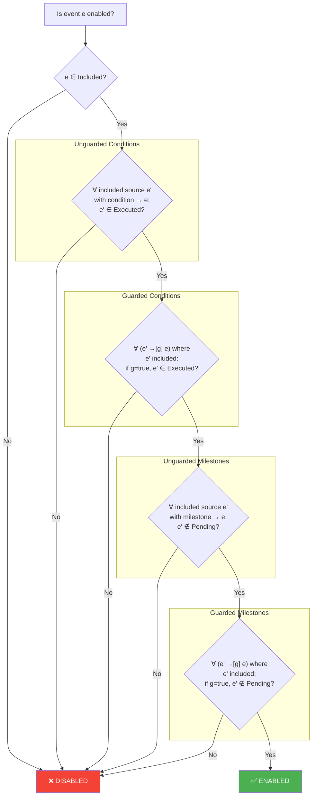

**Guard evaluation failure** (missing event values, type errors) is treated
as `guard = false`, making the relation inactive.  This ensures that guards
referencing events that haven't been executed yet don't spuriously block.

---

## 6. Execution Semantics (Definition 4)

When an enabled event fires, the marking is updated in a specific order:

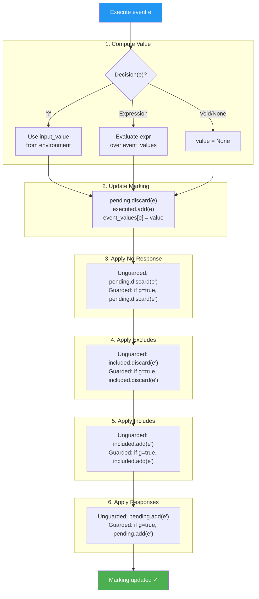

The order **no-response → exclude → include → response** is semantically
significant.  For example, a no-response may remove a pending obligation
before a response re-adds it (or vice versa).

---

## 7. Semantics Class Hierarchy

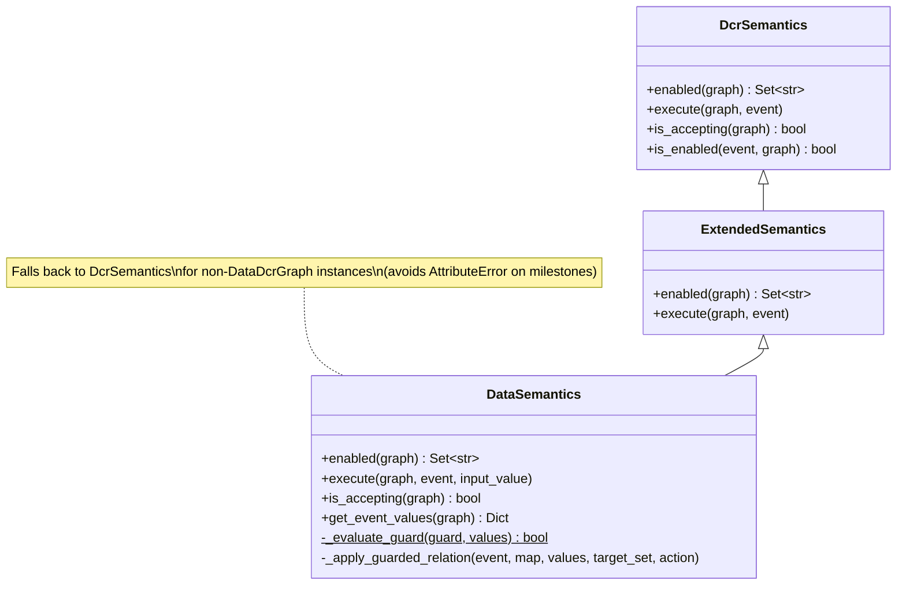

`DataSemantics` uses two key helper methods to avoid duplicated code:

- **`_evaluate_guard(guard, values)`** — safely evaluates a guard, returning
  `False` on `ValueError`, `KeyError`, or `TypeError`.
- **`_apply_guarded_relation(event, map, values, target_set, action)`** —
  iterates over a guarded relation dict and applies `add` or `discard`
  to the marking set for each guard that evaluates to `true`.

---

## 8. Conformance Checking Pipeline

Conformance checking uses the **decorator pattern** to layer data-aware
checks on top of the standard rule-based checker:

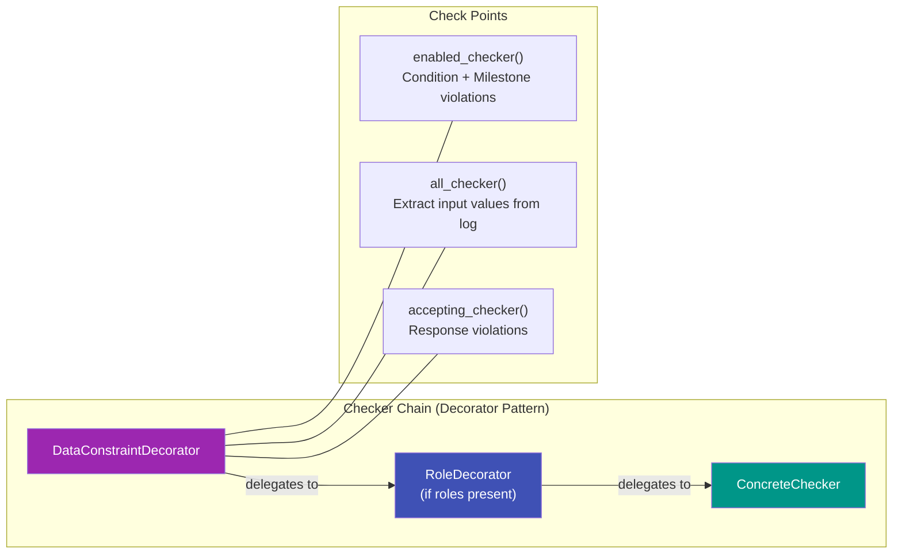

### DataConstraintDecorator Flow

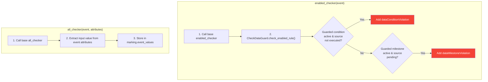

---

## 9. Replay Algorithm (Conformance)

The conformance replay iterates over each trace in the event log:

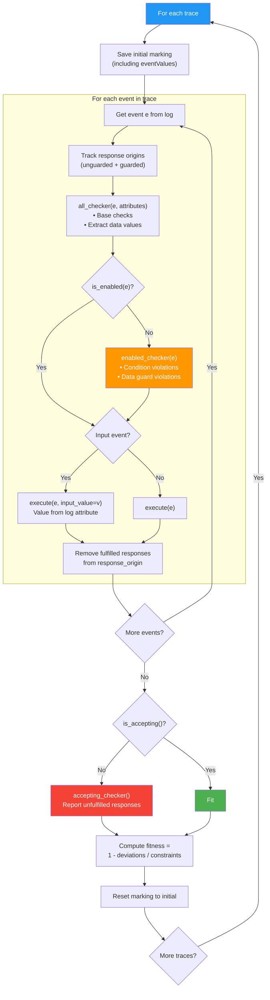

---

## 10. Running Example: Expense Report

The paper's expense report models an approval workflow where the decision
path depends on the amount and payment type:

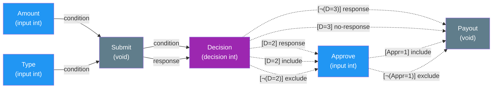

> Solid arrows = unguarded relations.  Dashed arrows = guarded relations
> with guard expression in brackets.

### Three Example Traces

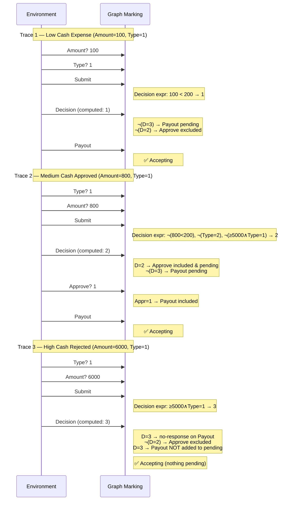

---

## 11. Module Layout

```
pm4py/objects/dcr/data/
├── expressions.py    # Expression AST, Guard, builder helpers
├── obj.py            # DataMarking, DataDcrGraph
└── semantics.py      # DataSemantics (enabled, execute)

pm4py/algo/conformance/dcr/
├── rules/
│   └── data_guard.py     # CheckDataGuard rule
└── decorators/
    └── datadecorator.py  # DataConstraintDecorator

tests/
└── dcr_data_test.py      # 77 tests across 13 test classes
```
